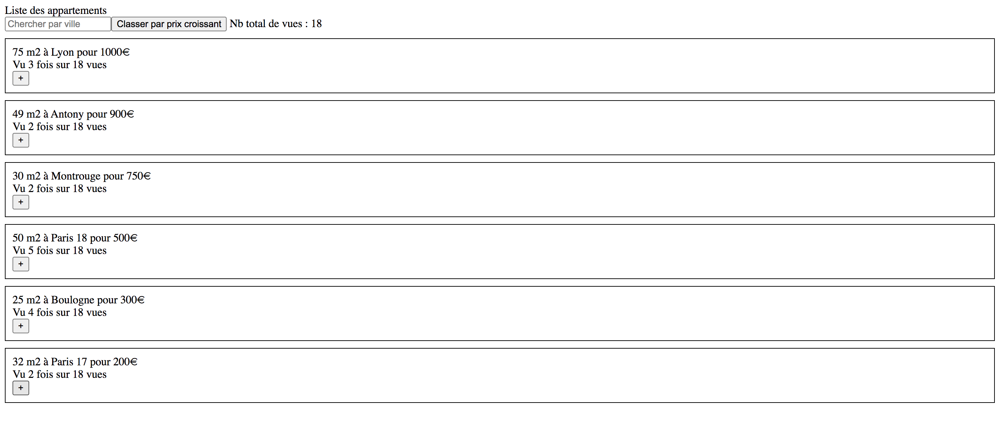

# entretien-boilerplate

## Description
Le composant App.vue contient en data une liste d'appartement.
L'objectif ici est de pouvoir:
- afficher la liste des appartements
- chercher par ville
- trier la liste par prix croissant et décroissant
- ajouter un compteur de nombre de click par vues
- avoir l'information du nombre total de vues

Voici un exemple de à quoi pourrait ressembler le projet final




## Project setup
```
yarn install
```

### Compiles and hot-reloads for development
```
yarn serve
```

### Compiles and minifies for production
```
yarn build
```

### Lints and fixes files
```
yarn lint
```

### Customize configuration
See [Configuration Reference](https://cli.vuejs.org/config/).
